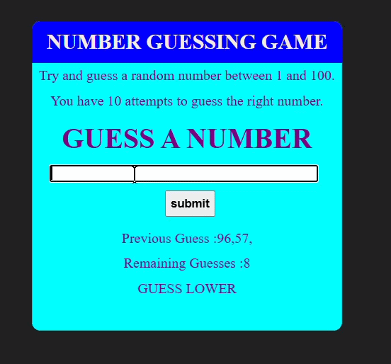

# Guess The Number Game

## 📌 Description

Guess The Number is a simple interactive web-based game built using HTML, CSS, and JavaScript. The computer randomly selects a number, and the player has 10 attempts to guess it correctly.

After each guess, the game provides feedback indicating whether the target number is higher or lower than the player's guess. The game also tracks previous guesses and displays the number of attempts remaining. Players can restart the game after winning or losing.

## ✨ Features

* Random number generation
* Interactive user input
* Hint system (higher/lower feedback)
* Tracks previous guesses
* Displays remaining attempts
* Win and lose conditions
* Restart game functionality

## 🛠️ Technologies Used

* HTML5
* CSS3
* JavaScript

## 🎮 How to Play

1. Enter a number in the input field.
2. Submit your guess.
3. Receive feedback:

   * "Guess Higher" if the guess is greater than the target number.
   * "Guess Lower" if the guess is less than the target number.
4. Continue guessing until:

   * You correctly guess the number, or
   * You exhaust all 10 attempts.
5. Start a new game using the restart option.

## ⚙️ How to Run

1. Clone the repository:

   ```bash
   git clone https://github.com/Aashu-Goswami/Guess-The-Number.git
   ```
2. Launch `index.html`.

## 🧠 Concepts Practiced

* DOM Manipulation
* Event Handling
* Conditional Statements
* Random Number Generation
* State Management
* User Input Validation

## 📸 Preview



## 🚀 Future Improvements

* Difficulty levels
* Score tracking
* Timer mode
* High score system
* Sound effects

## 🎯 Learning Purpose

This project was created to strengthen JavaScript fundamentals by implementing game logic, state management, and interactive user feedback.

## 👤 Author

Aashu Goswami

